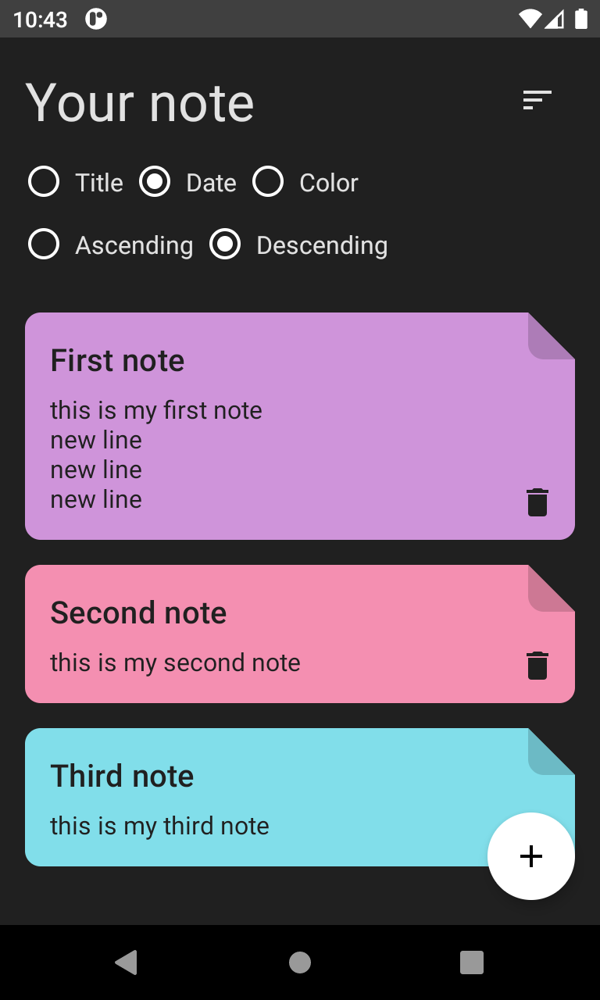
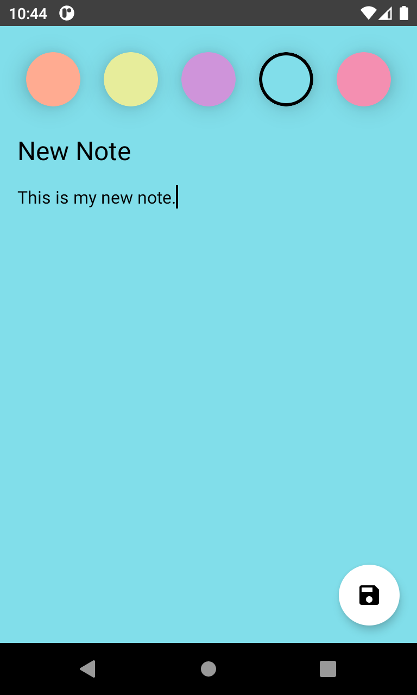

# Clean Architecture Note App

MVVM / CRUD / Jetpack Compose / Room Database

# Features
- [x] Listar anotações
- [x] Adicionar anotações
- [x] Deletar anotações
- [x] Editar anotações

# Tecnologias
As seguintes tecnologias foram utilizadas no projeto:

- [Android](https://developer.android.com/)
- [Kotlin](https://kotlinlang.org/)
- [MVVM](https://developer.android.com/jetpack/guide?hl=pt-br)
- [Room Database](https://developer.android.com/training/data-storage/room)
- [Android Compose](https://developer.android.com/jetpack/compose)

# Aprensetação
<h1>
    
</h1>

# Screencast
<h3>Listar anotações</h3>
<h1>
    
</h1>

<h3>Exibir anotações</h3>
<h1>
    
</h1>

# Considerações
Aplicativo desenvolvido com objetivos de divulgar e compatilhar meus conhecimentos sobre Dev Android. 

Feito por Kevin Lucas, me siga [Linkedin](https://www.linkedin.com/in/kevinlucasdev/). Obrigado!